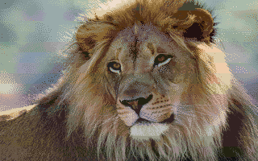
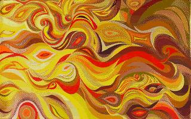
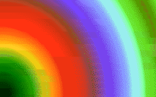
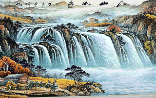
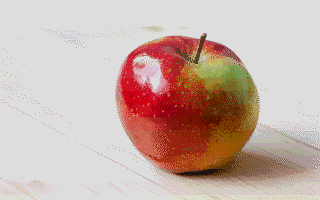

# Horizontal band converter 

This is an idea I had about resolving two of the big issues I saw with 3200 color images on the Apple IIgs.  1) They require a lot of CPU as it's a software-driven mode, constantly changing palette colors.  2) The banding from line-to-line as a set of 16 color palettes were being changed for each line often left to bad horizontal sripting or banding. 

The idea here is that we stick to the 256 colors available natively across 16 palettes on the Apple IIgs.  It is intended more for images whose chromatic variation is more diverse vertically.  This is currently a naîve implementation that doesn't really care about heuristics or user settings, but it often shows a more natural set of colors than traditional 3200 color images, due to less harsh banding.  The banding is restricted to larger vertical chunks and can often be less noticable.  Of course it is still quite obvious at times.  See "Problems".

## About
In this case we are targeting the 12-bit color space on the Apple IIgs (2^12 = 4096).  It color system allows 4-bits per channel, meaning I can have a red value from 0-15, a green value from 0-15, and a blue value from 0-15.  In hexadecimal it looks like this #$06FA, with the leftmost zero nibble being ignored on the IIgs. 

Then there are 16 palettes of 16 colors that we can assign to any of the 200 horizontal lines.

This program simply makes vertical chunks of 13 pixels and converts those to a 16 color palette in the 12 bit color space, then reassembles a final image.

## Prerequisite
You must have imagemagick installed.  To see if it's installed, open a command line and type `convert`

If you need to install it, for Mac OSX, I'd suggest `brew`:

```$ brew install imagemagick```


Linux - RHEL/CentOS

```$ sudo yum install ImageMagick```


Linux - Debian/Ubuntu

```$ sudo apt-get install imagemagick```

## Running the script to build an image
Basically you can just run the `slicer.sh` script against any image that imagemagick supports.

```./slicer.sh my_picture.png```

## Running the test suite

From the parent directory (the one this readme file is in), run the test script:

```$ ./tests/run_1.sh```

Output will be generated in the **out/** directory.

Here are some samples generated by the test suite:















